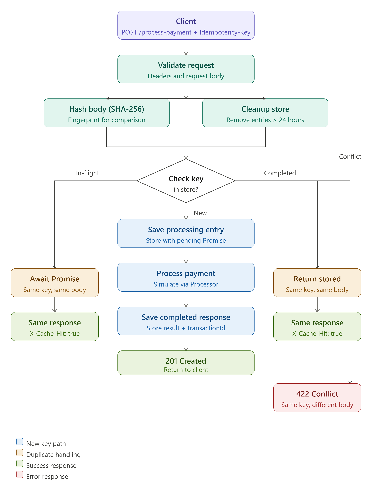

# FinSafe Idempotency Gateway

A Node.js and Express REST API that guards against duplicate payment charges by requiring an `Idempotency-Key` on each request. Developed for FinSafe Transactions Ltd., it addresses double-charging that can occur when clients retry after timeouts or network failures.

At its core, the service enforces one rule: only the first successful call for a given key actually processes a payment; any legitimate retry with the same key and body gets back the original response rather than initiating another charge.

## Architecture



## Request Outcomes

The gateway handles four distinct scenarios when an `Idempotency-Key` arrives:

| Scenario | When it happens | What the API does |
|---|---|---|
| Fresh key | No prior record exists for this key | Lock the key, run the payment, persist the response, respond with `201` |
| Concurrent retry | Matching key and body while the original request is still in progress | Join the in-flight `Promise` and return its outcome with `X-Cache-Hit: true` |
| Cached retry | Matching key and body after the original has finished | Return the saved status and body with `X-Cache-Hit: true` |
| Body mismatch | The key was already used with a different payload (in-flight or completed) | Respond with `422 Unprocessable Entity` |

## Getting Started

**Prerequisites:** Node.js and npm

Install packages:

```bash
npm install
```

Launch the server:

```bash
npm start
```

Default base URL:

```text
http://localhost:3000
```

Override the port:

```bash
PORT=4000 npm start
```

For local development with hot reload:

```bash
npm run dev
```

Execute the test suite:

```bash
npm test
```

## API Reference

### Process Payment

```http
POST /process-payment
```

**Headers (required):**

```text
Content-Type: application/json
Idempotency-Key: <unique-request-key>
```

**Sample payload:**

```json
{
  "amount": 100,
  "currency": "GHS"
}
```

**Input constraints:**

- `Idempotency-Key` — required, must not be empty, max 255 characters
- `amount` — must be a number greater than zero
- `currency` — must be exactly three alphabetic characters

**Example with curl:**

```bash
curl -i -X POST http://localhost:3000/process-payment \
  -H "Content-Type: application/json" \
  -H "Idempotency-Key: payment-001" \
  -d "{\"amount\":100,\"currency\":\"GHS\"}"
```

### Initial Request (Success)

**Status:** `201 Created`

**Body:**

```json
{
  "message": "Charged 100 GHS",
  "transactionId": "4c7d7df3-f9d6-44e1-9fcb-3c1fbaf8dfe5",
  "status": "success"
}
```

The initial call includes a ~2 second delay to mimic real payment processing latency.

### Retry With Identical Payload

When a client resends the same `Idempotency-Key` with an unchanged body, no second charge is made. The gateway returns the original status code and response body immediately.

**Extra response header:**

```text
X-Cache-Hit: true
```

### Key Reused With Different Payload

Reusing a key for a different request body is rejected — even if the first request has not finished yet — because the retry no longer refers to the same payment intent.

**Status:** `422 Unprocessable Entity`

**Body:**

```json
{
  "error": "Idempotency key already used for a different request body."
}
```

### No Idempotency-Key Header

**Status:** `400 Bad Request`

**Body:**

```json
{
  "error": "Idempotency-Key header is required"
}
```

### Missing or Malformed JSON Body

**Status:** `400 Bad Request`

**Body:**

```json
{
  "error": "Invalid or missing request body"
}
```

### Invalid Amount

Requests with negative, zero, non-numeric, or absent `amount` values fail validation before any idempotency logic runs.

**Status:** `400 Bad Request`

**Body:**

```json
{
  "error": "Amount must be a positive number"
}
```

## Implementation Notes

Idempotency state lives in a native JavaScript `Map`, indexed by the `Idempotency-Key` header. Each record holds:

```js
{
  bodyHash: string,
  status: "processing" | "done",
  promise: Promise | null,
  response: {
    statusCode: number,
    body: object
  } | null,
  createdAt: number
}
```

**Body hashing:** Before comparison, payloads are canonicalized:

- Object property names are sorted alphabetically, so `{ "amount": 100, "currency": "GHS" }` and `{ "currency": "GHS", "amount": 100 }` hash to the same value
- Array element order is kept as-is
- String values are normalized to NFC Unicode

The canonical JSON is then digested with SHA-256, enabling body comparison without retaining the full request payload.

**Concurrency:** When a new key arrives, the gateway registers an in-flight `Promise` before payment work begins. A concurrent duplicate with the same key and hash attaches to that same `Promise` instead of spawning a parallel charge.

**Replay:** Once processing completes, subsequent requests with a matching key and body receive the stored status code, response body, and `transactionId` unchanged.

## TTL Cleanup (Developer's Choice)

Stored idempotency entries expire after 24 hours. On each incoming payment request, records older than `86400000` ms (24 h) are purged from the `Map`.

In live fintech environments, idempotency caches accumulate keys indefinitely as clients submit new payments. Periodic TTL eviction limits memory growth and prevents replaying responses long after they are still meaningful.

An in-memory `Map` is sufficient for this single-instance demo. A multi-node production deployment would typically back the store with Redis or another shared, durable data layer.

## Testing

Tests run on Node's built-in test runner — no third-party framework needed.

```bash
npm test
```

**Coverage includes:**

- absent `Idempotency-Key`
- blank `Idempotency-Key`
- missing request body
- invalid `amount`
- invalid `currency`
- malformed JSON
- successful first payment
- duplicate replay (same key, same body)
- canonical body matching (different JSON key order)
- rejection when key is reused with a different body
- in-flight rejection on body mismatch
- concurrent duplicates sharing the original in-flight `Promise`

## Project Structure

```text
Idempotency-Gateway/
├── asset/
│   └── payment_idempotency_flowchart.png
├── src/
│   ├── app.js
│   ├── server.js
│   ├── middleware/
│   │   ├── validateHeaders.js
│   │   └── validatePaymentBody.js
│   ├── routes/
│   │   └── payment.js
│   ├── services/
│   │   ├── idempotencyStore.js
│   │   └── paymentProcess.js
│   └── utils/
│   │   └── hashBody.js
├── test/
│   └── payment.test.js
├── .gitignore
├── package.json
└── README.md
```
